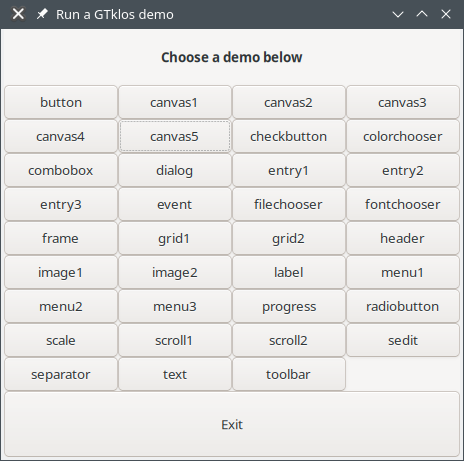

# GTKlos extension / Introduction


[Table of contents](README.md)


## Introduction

This extension permits to easily program GUI (Graphical User Interfaces) using the OO model of *STklos*. The model used here, is very similar to the one originally defined in [STk Scheme](http://kaolin.unice.fr/STk). It is described in the [JFP](https://www.stklos.net/~eg/Publis/jfp03.pdf) and [ISOTAS](https://www.stklos.net/~eg/Publis/Isotas96.pdf) papers.

Programming interfaces with the OO model permits to define your own widgets thanks to the MOP (Meta Object Protocol) of *STklos*.

### Installation

The extension is in the `extensions/gtklos` directory of *STklos*. It is configured when you run `configure` in the main directory of *STklos*. So, to compile it you just need to run

```bash
    $ make
```

The `demos` directory contains several demos that can be run separately or with the `demos` script in this directory. Running this script, with

```bash
$ cd demos
$ ./demos
```

you should obtain something like:



If everything is correct, you can install the *GTklos* extension with a `make install` in the `gtklos` directory. Everything will be installed in a sub-directory of the main *STklos* installation

## Getting started

To use the *GTklos* extension you need to require the `"gtklos"` and import the `GTKLOS` module. This can be done with:

```scheme
(require "gtklos")  ;; to load the gtklos extension
(import GTKLOS)     ;; to acces the GTKLOS exported symols
```

**Content**

### A first window

The first thing you must do to make an interface consists to create an instance of the class `<window>`. For instance,

```scheme
stklos> (define w (make <window> #:tile "A first window"))
```
will create a window with a title set to `"A first window"`. You can see all the  slots that can be set in `w` by using describe:

```scheme
(describe w)
stklos> (describe w)
#[<window> 7f29ae290d80] is an an instance of class <window>.
Slots are: 
     %children = ()
     %data = ()
     %event = ()
     border-width = 0
     can-default = #f
     can-focus = #f
     children = ()
     has-default = #f
     has-focus = #f
     height = 200
     height-request = -1
     modal = #f
     name = ""
     parent = #f
     resizable = #t
     sensitive = #t
     show = #t
     title = "STklos window"
     tooltip = #f
     transient = #f
     visible = #t
     wid = #[gtk-window-pointer 559bf9d1c2a0 @ 7f29ae290c00]
     width = 200
     width-request = -1
stklos> 
```

Now that the window is creates, we need to start the GTK+ interaction loop to see it effectively on our screen. This can be done by calling 
- `(start-interactive-gtk)`, or
- `(gtk-main)`

As said by its name the fist form, is preferred when we create an interface interactively on the REPL. This form, call the GTK* event loop when your keyboard is idle. The second form is generally used when you create a script and dont use the REPL. 

As we cans see, the *width* and the *height* of this window are reflected in the `xidth` and `height` of `w`. Hearafter are some manipulation with the width of `w`:


```scheme
stklos> (start-interactive-gtk)   ;; to develop the GUI in the REPLREPL
;; Setting the width to 400
stklos> (slot-set! w 'width 400)
;; reading back the value
stklos> (slot-ref w 'width)
400

;; Since accessors are defined on all slots we can also do
stklos> (width w)
400
stklos> (set! (width w) 300)
stklos> (width w)
300
```

Of course,  we can also define the widget size at creation time with a class such as

```scheme 
stklos> (define w (make <window> #:tile "A first window"
                                 #:width 400
                                 #:height 100))
```

### Adding a button

We can add a button to a the previous window bay making an instance of a `<button>`:

```scheme
(define b (make <button> #:parent w #:text "A button"))
```

By saying that the parent of `b` is `w`, the window we have just created just
before, this button will be *inside* the `w` window. So, we will obtain:


Using describe, on `b` we have:

```scheme
stklos> (describe b)
#[<button> 7fd77809e270] is an an instance of class <button>.
Slots are: 
     %children = ()
     %data = ()
     %event = ()
     border-width = 0
     can-default = #f
     can-focus = #t
     children = ()
     command = #f
     focus-on-click = #t
     has-default = #f
     has-focus = #f
     height = 100
     height-request = -1
     image = #f
     name = ""
     parent = #[<window> 7fd77d2b1690]
     relief = normal
     sensitive = #t
     show = #t
     text = "A button"
     tooltip = #f
     use-stock = #f
     use-underline = #t
     visible = #t
     wid = #[gtk-button-pointer 5612fef76180 @ 7fd77809e210]
     width = 400
     width-request = -1
     xalign = 0.5
     yalign = 0.5
stklos> 
```

The slot `command` is particularly important on buttons. It contains the function that will be called when we click (with left mouse button) on `b`. The function will be called with two parameters the widget which have been clicked and an event object which contains all the information on the event itself (more on that below).

We can add a *command* to the previous button with:

```scheme
stklos> (set! (command b)
              (λ (w e)
                (printf "Button ~s was clicked\n" w)))
``` 

This ends this small introduction on GTklos.


<!-- Local Variables: -->
<!-- compile-command: "md31 README.md README.html" -->
<!-- End: -->
